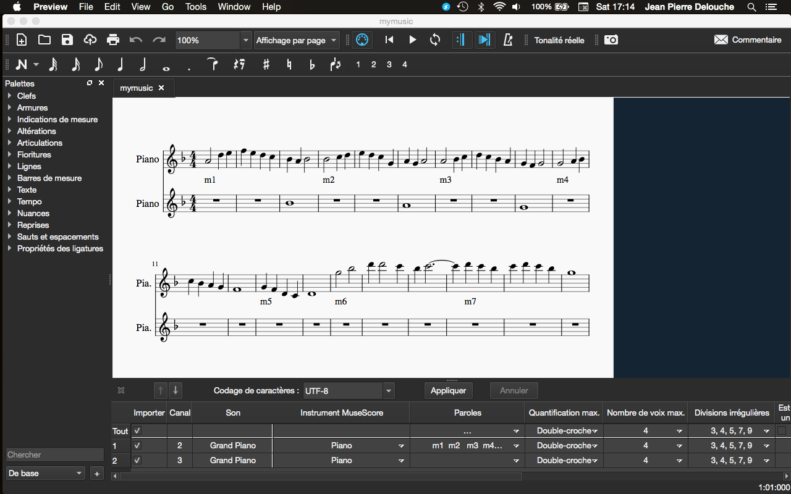

# hmusic
Midi haskell music

Command line:

cabal install && cat europa.txt | dist/build/hmusic/hmusic && /Applications/VLC.app/Contents/MacOS/VLC -I dummy mymusic.mid vlc://quit

input  : europa.txt

output : mymusic.mid

Syntaxe: 
>
    #m1  #
    a1- pause
    #   pause
    d2  pause
    e2  pause
    f2  pause
    e2  pause
    d2  pause
    c2  pause
    lb1 lb1_
    end end

Using HCodecs from http://hackage.haskell.org/package/HCodecs

The midi file can be used with https://musescore.org/fr

